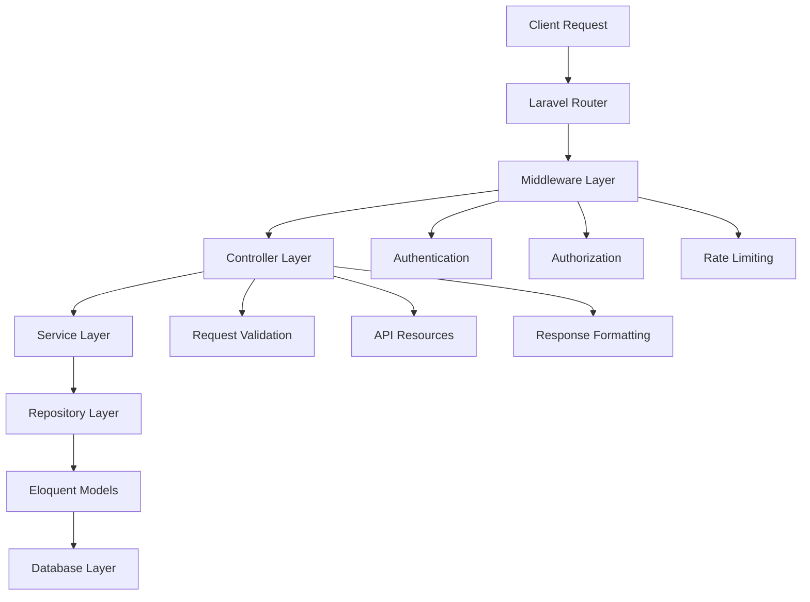
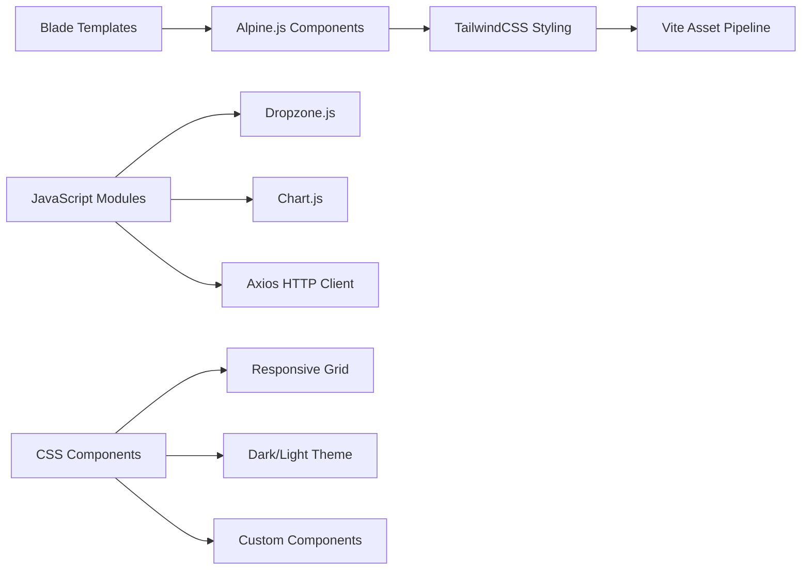
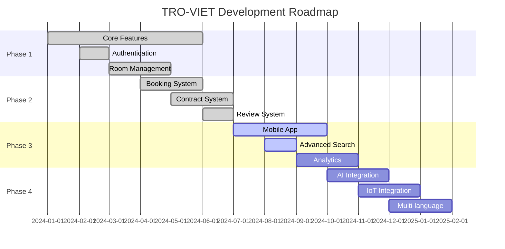

# 🏠 TRO-VIET - Hệ thống quản lý nhà trọ thông minh

<p align="center">
  
</p>

<p align="center">
  <strong>🌟 Nền tảng kết nối không gian sống lý tưởng 🌟</strong><br>
  Hệ thống quản lý nhà trọ toàn diện với giao diện hiện đại, tính năng đa dạng và công nghệ tiên tiến
</p>

<p align="center">
  
  
  
  
  
  
</p>

<p align="center">
  
  
  
  
</p>

---

## 📖 Giới thiệu

**TRO-VIET** là một hệ thống quản lý nhà trọ thông minh được phát triển trên nền tảng Laravel 12.0 framework hiện đại. Ứng dụng cung cấp giải pháp toàn diện cho việc quản lý tòa nhà, phòng trọ, khách thuê và các hoạt động kinh doanh cho thuê phòng trọ một cách hiệu quả và chuyên nghiệp.

### 🎯 Mục tiêu

-   🔄 **Số hóa hoàn toàn** quy trình quản lý nhà trọ
-   🤝 **Kết nối thông minh** giữa chủ trọ và người thuê
-   📊 **Cung cấp công cụ** quản lý hiệu quả và minh bạch
-   📈 **Hỗ trợ quyết định** kinh doanh dựa trên dữ liệu phân tích
-   🌐 **Tối ưu trải nghiệm** người dùng với giao diện hiện đại

### 🏆 Ưu điểm nổi bật

-   ⚡ **Hiệu suất cao** với Laravel 12.0 và Vite 6.2.5
-   🎨 **Giao diện đẹp** với TailwindCSS 3.4.17 và Alpine.js 3.14.9
-   🔐 **Bảo mật tối ưu** với Spatie Permission và Laravel Breeze
-   📱 **Responsive Design** tương thích mọi thiết bị
-   🧪 **Testing Coverage** với Pest Framework
-   🚀 **Easy Deployment** với Docker support

---

## ✨ Tính năng chính

### 🏢 **Quản lý Tòa nhà & Phòng trọ**

-   ✅ **Quản lý tòa nhà đa cấp**: Tên, địa chỉ, vị trí địa lý (Tỉnh/Quận/Phường)
-   ✅ **Quản lý phòng trọ chi tiết**: Số phòng, diện tích, giá thuê, tiền cọc
-   ✅ **Theo dõi trạng thái realtime**: Available/Occupied với workflow tự động
-   ✅ **Hỗ trợ phòng ở ghép**: Quản lý max_person và current_tenant_count
-   ✅ **Gallery hình ảnh**: Upload/quản lý nhiều ảnh với Dropzone.js
-   ✅ **Utilities management**: Điện, nước, wifi, điều hòa, etc.

### 👥 **Hệ thống Người dùng & Phân quyền**

-   ✅ **Role-based Access Control** với Spatie Permission:
    -   👑 **Super Admin**: Quản trị toàn hệ thống
    -   🏢 **Landlord**: Quản lý tòa nhà và phòng trọ sở hữu
    -   🏠 **Tenant**: Tìm kiếm, đặt phòng và đánh giá
-   ✅ **Middleware bảo mật** cho từng route và controller
-   ✅ **Permission-based UI** hiển thị động theo quyền hạn
-   ✅ **User Profile Management** với avatar và thông tin cá nhân

### 📅 **Hệ thống Đặt phòng & Hợp đồng**

-   ✅ **Booking workflow hoàn chỉnh**:
    -   Tạo booking với desired_move_date và duration
    -   Trạng thái: pending → approved → rejected/cancelled
    -   Auto-notification cho landlord
-   ✅ **Contract management**:
    -   Tạo hợp đồng điện tử từ booking được duyệt
    -   Digital signature với signature_path
    -   Contract numbering tự động
    -   Export PDF với Laravel TCPDF
-   ✅ **Payment tracking**: Monthly rent, deposit amount tracking

### ⭐ **Hệ thống Đánh giá & Phản hồi**

-   ✅ **5-star Rating System** với validation
-   ✅ **Review Comments** từ tenant thực tế
-   ✅ **Average Rating Calculation** tự động
-   ✅ **Review Authentication**: Chỉ tenant đã thuê mới được review
-   ✅ **Review Moderation**: Admin có thể quản lý reviews

### 📊 **Dashboard & Analytics**

-   ✅ **Multi-role Dashboard**:
    -   Admin: System overview, user management, global stats
    -   Landlord: Buildings/rooms stats, booking management
    -   Tenant: Personal bookings, contracts, favorite rooms
-   ✅ **Real-time Statistics**: Room occupancy, revenue, tenant count
-   ✅ **Chart.js Integration**: Visual data representation
-   ✅ **Export Reports**: PDF/Excel export capabilities

### 🗺️ **Hệ thống Địa lý thông minh**

-   ✅ **3-tier Geographic System**:
    -   Provinces (Tỉnh/Thành phố)
    -   Districts (Quận/Huyện)
    -   Wards (Phường/Xã)
-   ✅ **Dynamic Dropdown**: Ajax-based location selection
-   ✅ **Address Autocomplete**: Smart address formatting
-   ✅ **Location-based Search**: Filter rooms by geographic location

---

## 🏗️ Kiến trúc hệ thống

### **Backend Architecture**



**Technology Stack:**

```
├── 🔧 Laravel 12.0 Framework (Core)
├── 🛡️ Authentication & Authorization (Laravel Breeze + Spatie Permission)
├── 🗄️ Database Layer (SQLite for dev, MySQL/PostgreSQL for prod)
├── 📡 RESTful API Endpoints với Resource Controllers
├── 🎯 MVC Pattern với Service & Repository Layers
├── 📋 Request Validation & API Resources
├── ⚡ Query Optimization với Spatie Query Builder
└── 🧪 Testing với Pest Framework
```

### **Frontend Architecture**



**Technology Stack:**

```
├── 🎨 TailwindCSS 3.4.17 (Utility-first CSS framework)
├── ⚡ Alpine.js 3.14.9 (Reactive JavaScript framework)
├── 📱 Responsive Design (Mobile-first approach)
├── 🔄 Vite 6.2.5 (Fast build tool & dev server)
├── 🖼️ Dropzone.js 6.0.0-beta.2 (File uploads với drag & drop)
├── 📊 Chart.js (Data visualization & analytics)
├── 🌐 Axios 1.9.0 (HTTP client for API calls)
└── 🎭 Blade Components (Reusable UI components)
```

├── 📱 Responsive Design (Mobile-first)
├── 🔄 Vite 6.2 (Fast build tool)
├── 🖼️ Dropzone.js (File uploads)
└── 📊 Chart.js (Data visualization)

````

---

## 🗃️ Cấu trúc Database

### **Entity Relationship Diagram**

```mermaid
erDiagram
    USERS ||--o{ BUILDINGS : owns
    USERS ||--o{ BOOKINGS : creates
    USERS ||--o{ REVIEWS : writes
    USERS ||--o{ CONTRACTS : signs

    BUILDINGS ||--o{ ROOMS : contains
    BUILDINGS }|--|| WARDS : located_in
    WARDS }|--|| DISTRICTS : belongs_to
    DISTRICTS }|--|| PROVINCES : belongs_to

    ROOMS ||--o{ BOOKINGS : receives
    ROOMS ||--o{ REVIEWS : has
    ROOMS ||--o{ CONTRACTS : covered_by
    ROOMS ||--o{ ROOM_IMAGES : displays

    BOOKINGS ||--o| CONTRACTS : generates

    IMAGES ||--o{ ROOM_IMAGES : used_in
````

### **Bảng chính**

#### 🏢 **buildings** (Tòa nhà)

```sql
CREATE TABLE buildings (
    id BIGINT PRIMARY KEY AUTO_INCREMENT,
    name VARCHAR(255) NOT NULL,
    address TEXT NOT NULL,
    user_id BIGINT NOT NULL, -- Chủ sở hữu
    province_id BIGINT NOT NULL,
    district_id BIGINT NOT NULL,
    ward_id BIGINT NOT NULL,
    created_at TIMESTAMP,
    updated_at TIMESTAMP,

    FOREIGN KEY (user_id) REFERENCES users(id),
    FOREIGN KEY (province_id) REFERENCES provinces(id),
    FOREIGN KEY (district_id) REFERENCES districts(id),
    FOREIGN KEY (ward_id) REFERENCES wards(id)
);
```

#### 🚪 **rooms** (Phòng trọ)

```sql
CREATE TABLE rooms (
    id BIGINT PRIMARY KEY AUTO_INCREMENT,
    room_number VARCHAR(50) NOT NULL,
    area DECIMAL(8,2) NOT NULL, -- Diện tích (m²)
    price DECIMAL(15,2) NOT NULL, -- Giá thuê/tháng
    deposit DECIMAL(15,2) NOT NULL, -- Tiền cọc
    status ENUM('available', 'occupied') DEFAULT 'available',
    max_person INT DEFAULT 1, -- Số người tối đa
    utilities TEXT, -- JSON: điện, nước, wifi, etc.
    description TEXT,
    building_id BIGINT NOT NULL,
    created_at TIMESTAMP,
    updated_at TIMESTAMP,

    FOREIGN KEY (building_id) REFERENCES buildings(id) ON DELETE CASCADE,
    INDEX idx_status (status),
    INDEX idx_price (price),
    INDEX idx_building (building_id)
);
```

#### 👤 **users** (Người dùng)

```sql
CREATE TABLE users (
    id BIGINT PRIMARY KEY AUTO_INCREMENT,
    name VARCHAR(255) NOT NULL,
    email VARCHAR(255) UNIQUE NOT NULL,
    email_verified_at TIMESTAMP NULL,
    password VARCHAR(255) NOT NULL,
    phone VARCHAR(20),
    address TEXT,
    remember_token VARCHAR(100),
    created_at TIMESTAMP,
    updated_at TIMESTAMP,

    INDEX idx_email (email)
);
```

#### 📋 **bookings** (Đặt phòng)

```sql
CREATE TABLE bookings (
    id BIGINT PRIMARY KEY AUTO_INCREMENT,
    user_id BIGINT NOT NULL, -- Người đặt
    room_id BIGINT NOT NULL, -- Phòng được đặt
    desired_move_date DATE NOT NULL, -- Ngày mong muốn chuyển vào
    duration INT NOT NULL, -- Thời gian thuê (tháng)
    note TEXT, -- Ghi chú
    status ENUM('pending', 'approved', 'rejected', 'cancelled') DEFAULT 'pending',
    created_at TIMESTAMP,
    updated_at TIMESTAMP,

    FOREIGN KEY (user_id) REFERENCES users(id),
    FOREIGN KEY (room_id) REFERENCES rooms(id),
    INDEX idx_status (status),
    INDEX idx_user (user_id),
    INDEX idx_room (room_id)
);
```

#### 📄 **contracts** (Hợp đồng)

```sql
CREATE TABLE contracts (
    id BIGINT PRIMARY KEY AUTO_INCREMENT,
    contract_number VARCHAR(100) UNIQUE NOT NULL, -- Số hợp đồng
    booking_id BIGINT NOT NULL, -- Booking gốc
    room_id BIGINT NOT NULL,
    tenant_id BIGINT NOT NULL, -- Người thuê
    landlord_id BIGINT NOT NULL, -- Chủ trọ
    start_date DATE NOT NULL, -- Ngày bắt đầu
    end_date DATE NOT NULL, -- Ngày kết thúc
    monthly_rent DECIMAL(15,2) NOT NULL, -- Tiền thuê/tháng
    deposit_amount DECIMAL(15,2) NOT NULL, -- Số tiền cọc
    terms_and_conditions TEXT, -- Điều khoản hợp đồng
    status ENUM('pending', 'active', 'expired', 'terminated') DEFAULT 'pending',
    file_path VARCHAR(500), -- Đường dẫn file PDF
    signature_path VARCHAR(500), -- Đường dẫn chữ ký
    signed_at TIMESTAMP NULL, -- Thời gian ký
    created_at TIMESTAMP,
    updated_at TIMESTAMP,

    FOREIGN KEY (booking_id) REFERENCES bookings(id),
    FOREIGN KEY (room_id) REFERENCES rooms(id),
    FOREIGN KEY (tenant_id) REFERENCES users(id),
    FOREIGN KEY (landlord_id) REFERENCES users(id),
    INDEX idx_contract_number (contract_number),
    INDEX idx_status (status)
);
```

#### ⭐ **reviews** (Đánh giá)

```sql
CREATE TABLE reviews (
    id BIGINT PRIMARY KEY AUTO_INCREMENT,
    room_id BIGINT NOT NULL,
    user_id BIGINT NOT NULL, -- Người đánh giá
    rating TINYINT NOT NULL CHECK (rating >= 1 AND rating <= 5),
    comment TEXT,
    created_at TIMESTAMP,
    updated_at TIMESTAMP,

    FOREIGN KEY (room_id) REFERENCES rooms(id) ON DELETE CASCADE,
    FOREIGN KEY (user_id) REFERENCES users(id),
    UNIQUE KEY unique_user_room (user_id, room_id), -- Mỗi user chỉ review 1 lần/phòng
    INDEX idx_rating (rating)
);
```

#### 🖼️ **images & room_images** (Hình ảnh)

```sql
CREATE TABLE images (
    id BIGINT PRIMARY KEY AUTO_INCREMENT,
    path VARCHAR(500) NOT NULL, -- Đường dẫn file
    name VARCHAR(255) NOT NULL, -- Tên file gốc
    size BIGINT NOT NULL, -- Kích thước file (bytes)
    type VARCHAR(100) NOT NULL, -- MIME type
    isMain BOOLEAN DEFAULT FALSE, -- Ảnh chính
    created_at TIMESTAMP,
    updated_at TIMESTAMP
);

CREATE TABLE room_images (
    room_id BIGINT NOT NULL,
    image_id BIGINT NOT NULL,

    PRIMARY KEY (room_id, image_id),
    FOREIGN KEY (room_id) REFERENCES rooms(id) ON DELETE CASCADE,
    FOREIGN KEY (image_id) REFERENCES images(id) ON DELETE CASCADE
);
```

### **Hệ thống Địa lý (3-tier)**

```sql
-- Tỉnh/Thành phố
CREATE TABLE provinces (
    id BIGINT PRIMARY KEY AUTO_INCREMENT,
    name VARCHAR(255) NOT NULL,
    code VARCHAR(20) UNIQUE NOT NULL
);

-- Quận/Huyện
CREATE TABLE districts (
    id BIGINT PRIMARY KEY AUTO_INCREMENT,
    name VARCHAR(255) NOT NULL,
    code VARCHAR(20) NOT NULL,
    province_id BIGINT NOT NULL,

    FOREIGN KEY (province_id) REFERENCES provinces(id)
);

-- Phường/Xã
CREATE TABLE wards (
    id BIGINT PRIMARY KEY AUTO_INCREMENT,
    name VARCHAR(255) NOT NULL,
    code VARCHAR(20) NOT NULL,
    district_id BIGINT NOT NULL,

    FOREIGN KEY (district_id) REFERENCES districts(id)
);
```

### **Hệ thống Phân quyền (Spatie Permission)**

```sql
-- Roles và Permissions được quản lý bởi Spatie Package
roles: id, name, guard_name, created_at, updated_at
permissions: id, name, guard_name, created_at, updated_at
model_has_roles: model_type, model_id, role_id
model_has_permissions: model_type, model_id, permission_id
role_has_permissions: permission_id, role_id
```

**Roles được định nghĩa:**

-   `super-admin`: Toàn quyền hệ thống
-   `landlord`: Quản lý tòa nhà và phòng trọ
-   `tenant`: Tìm kiếm và thuê phòng

---

## 🚀 Cài đặt và Triển khai

### **📋 Yêu cầu hệ thống**

| Requirement  | Version | Mô tả                      | Kiểm tra             |
| ------------ | ------- | -------------------------- | -------------------- |
| **PHP**      | >= 8.2  | Programming language       | `php --version`      |
| **Composer** | >= 2.0  | PHP dependency manager     | `composer --version` |
| **Node.js**  | >= 18.0 | JavaScript runtime         | `node --version`     |
| **NPM**      | >= 8.0  | JavaScript package manager | `npm --version`      |
| **Database** | Any     | SQLite/MySQL/PostgreSQL    | Included in setup    |
| **Git**      | Any     | Version control            | `git --version`      |

### **🔧 Cài đặt từ đầu (Fresh Installation)**

#### **Bước 1: Clone project**

```bash
# Clone repository
git clone https://github.com/your-username/tro-viet.git
cd tro-viet

# Hoặc download ZIP và extract
wget https://github.com/your-username/tro-viet/archive/main.zip
unzip main.zip && cd tro-viet-main
```

#### **Bước 2: Cài đặt Backend Dependencies**

```bash
# Cài đặt PHP dependencies
composer install

# Verify installation
composer show | grep laravel
```

#### **Bước 3: Cài đặt Frontend Dependencies**

```bash
# Cài đặt Node.js dependencies
npm install

# Verify installation
npm list --depth=0
```

#### **Bước 4: Cấu hình Environment**

```bash
# Copy environment file
cp .env.example .env

# Generate application key
php artisan key:generate

# Create symbolic link for storage
php artisan storage:link
```

#### **Bước 5: Cấu hình Database**

**Option A: SQLite (Recommended for Development)**

```bash
# Tạo SQLite database file
touch database/database.sqlite

# Cập nhật .env file
sed -i 's/DB_CONNECTION=mysql/DB_CONNECTION=sqlite/' .env
sed -i 's/DB_DATABASE=laravel/DB_DATABASE=database\/database.sqlite/' .env
```

**Option B: MySQL/MariaDB**

```env
# Cập nhật .env file
DB_CONNECTION=mysql
DB_HOST=127.0.0.1
DB_PORT=3306
DB_DATABASE=tro_viet
DB_USERNAME=your_username
DB_PASSWORD=your_password
```

**Option C: PostgreSQL**

```env
# Cập nhật .env file
DB_CONNECTION=pgsql
DB_HOST=127.0.0.1
DB_PORT=5432
DB_DATABASE=tro_viet
DB_USERNAME=your_username
DB_PASSWORD=your_password
```

#### **Bước 6: Thiết lập Database Schema & Data**

```bash
# Chạy migrations để tạo database structure
php artisan migrate

# Cài đặt Spatie Permission tables
php artisan vendor:publish --provider="Spatie\Permission\PermissionServiceProvider"

# Seed database với demo data
php artisan db:seed

# Verify database setup
php artisan tinker
>>> App\Models\User::count()
>>> App\Models\Room::count()
```

#### **Bước 7: Build Frontend Assets**

```bash
# Development build (with hot reload)
npm run dev

# Production build (optimized)
npm run build

# Verify build
ls public/build
```

#### **Bước 8: Khởi chạy Development Server**

```bash
# Terminal 1: Laravel development server
php artisan serve

# Terminal 2: Vite development server (nếu dùng npm run dev)
npm run dev

# Check if everything is working
curl http://localhost:8000
```

### **🐳 Docker Setup (Alternative)**

```bash
# Sử dụng Laravel Sail
./vendor/bin/sail up -d

# Chạy migrations trong container
./vendor/bin/sail artisan migrate --seed

# Access via browser
http://localhost
```

### **✅ Verification Steps**

```bash
# 1. Check Laravel installation
php artisan --version

# 2. Check database connection
php artisan migrate:status

# 3. Check file permissions
php artisan storage:link
ls -la storage/

# 4. Test authentication
php artisan route:list | grep auth

# 5. Check demo data
php artisan tinker
>>> App\Models\User::role('admin')->first()
>>> App\Models\Room::with('building')->first()
```

### **🚨 Troubleshooting**

<details>
<summary><strong>Common Issues & Solutions</strong></summary>

**❌ Problem: Permission denied for storage/**

```bash
# Fix file permissions
chmod -R 755 storage bootstrap/cache
chown -R www-data:www-data storage bootstrap/cache
```

**❌ Problem: Vite build errors**

```bash
# Clear npm cache
npm cache clean --force
rm -rf node_modules package-lock.json
npm install
```

**❌ Problem: Database connection failed**

```bash
# Check database configuration
php artisan config:clear
php artisan config:cache
```

**❌ Problem: Missing APP_KEY**

```bash
# Generate new application key
php artisan key:generate --force
```

**❌ Problem: Routes not working**

```bash
# Clear all caches
php artisan optimize:clear
php artisan config:clear
php artisan route:clear
php artisan view:clear
```

</details>

### **🎉 Success! Truy cập ứng dụng**

-   **Frontend**: http://localhost:8000
-   **Admin Panel**: http://localhost:8000/admin/dashboard (với account admin)
-   **API Endpoints**: http://localhost:8000/api/\*

### **⚡ Quick Start cho Development**

```bash
# One-liner setup script
composer install && npm install && cp .env.example .env && php artisan key:generate && touch database/database.sqlite && php artisan migrate --seed && npm run build && php artisan serve
```

---

## 👥 Tài khoản Demo

Sau khi chạy `php artisan db:seed`, bạn có thể đăng nhập với các tài khoản demo sau:

<table>
<thead>
<tr>
<th>🎭 Vai trò</th>
<th>📧 Email</th>
<th>🔑 Password</th>
<th>🛠️ Quyền hạn & Tính năng</th>
</tr>
</thead>
<tbody>
<tr>
<td><strong>👑 Super Admin</strong></td>
<td><code>admin@gmail.com</code></td>
<td><code>12345678</code></td>
<td>
• Quản trị toàn hệ thống<br>
• User & role management<br>
• System statistics & reports<br>
• Global booking & contract management<br>
• Database management access
</td>
</tr>
<tr>
<td><strong>🏢 Landlord</strong></td>
<td><code>landlord@gmail.com</code></td>
<td><code>12345678</code></td>
<td>
• Quản lý tòa nhà sở hữu<br>
• CRUD phòng trọ với image upload<br>
• Approve/reject booking requests<br>
• Tạo & quản lý contracts<br>
• Tenant management dashboard
</td>
</tr>
<tr>
<td><strong>🏠 Tenant</strong></td>
<td><code>tenant@gmail.com</code></td>
<td><code>12345678</code></td>
<td>
• Tìm kiếm & browse rooms<br>
• Tạo booking requests<br>
• Xem & ký digital contracts<br>
• Đánh giá & review rooms<br>
• Personal booking history
</td>
</tr>
</tbody>
</table>

### **🎯 Demo Scenarios để Test**

#### **👑 Admin Workflow:**

1. Đăng nhập với `admin@gmail.com`
2. Truy cập `/admin/users` để quản lý users
3. Xem system statistics tại `/admin/statistics`
4. Quản lý global bookings tại `/admin/bookings`

#### **🏢 Landlord Workflow:**

1. Đăng nhập với `landlord@gmail.com`
2. Tạo building mới tại `/landlord/buildings/create`
3. Thêm rooms cho building với images
4. Xem booking requests tại `/landlord/bookings`
5. Approve bookings và tạo contracts

#### **🏠 Tenant Workflow:**

1. Đăng nhập với `tenant@gmail.com`
2. Browse rooms available tại `/motel`
3. Tạo booking request cho room
4. Xem booking status tại `/tenant/bookings`
5. Ký contract khi được approve
6. Viết review sau khi thuê

### **🔄 Reset Demo Data**

```bash
# Reset database và tạo lại demo data
php artisan migrate:fresh --seed

# Hoặc chỉ reset data mà giữ nguyên structure
php artisan db:seed --class=DatabaseSeeder --force
```

---

## 🛠️ Cấu trúc thư mục

```
tro-viet/
├── 📁 app/
│   ├── 📁 Http/
│   │   ├── 📁 Controllers/        # API & Web Controllers
│   │   │   ├── 📁 Admin/         # Admin Management Controllers
│   │   │   │   ├── BookingController.php     # Admin booking management
│   │   │   │   ├── ContractController.php    # Admin contract management
│   │   │   │   └── TenantController.php      # Tenant management & stats
│   │   │   ├── 📁 Auth/          # Authentication Controllers (Laravel Breeze)
│   │   │   ├── BookingController.php         # User booking operations
│   │   │   ├── BuildingController.php        # Building CRUD operations
│   │   │   ├── ContractController.php        # Contract management
│   │   │   ├── HomeController.php            # Public pages (about, contact)
│   │   │   ├── ImageController.php           # Image upload & management
│   │   │   ├── ProfileController.php         # User profile management
│   │   │   ├── ReviewController.php          # Review & rating system
│   │   │   ├── RoomController.php            # Room CRUD & search
│   │   │   ├── RoomImageController.php       # Room image association
│   │   │   └── UserController.php            # User management
│   │   ├── 📁 Middleware/        # Custom Middleware
│   │   │   ├── CheckRole.php                 # Role-based access control
│   │   │   ├── AdminMiddleware.php           # Admin-only routes protection
│   │   │   └── LandlordMiddleware.php        # Landlord-only routes protection
│   │   ├── 📁 Requests/          # Form Request Validation
│   │   │   ├── BookingRequest.php            # Booking validation rules
│   │   │   ├── BuildingRequest.php           # Building validation rules
│   │   │   ├── ContractRequest.php           # Contract validation rules
│   │   │   ├── ReviewRequest.php             # Review validation rules
│   │   │   └── RoomRequest.php               # Room validation rules
│   │   └── 📁 Resources/         # API Resources (JSON Transformation)
│   │       ├── BookingResource.php           # Booking API response format
│   │       ├── BuildingResource.php          # Building API response format
│   │       ├── RoomResource.php              # Room API response format
│   │       └── UserResource.php              # User API response format
│   ├── 📁 Models/                # Eloquent Models
│   │   ├── Booking.php                       # Booking model với relationships
│   │   ├── Building.php                      # Building model với địa lý
│   │   ├── Contract.php                      # Contract model với file handling
│   │   ├── District.php                      # District geographic model
│   │   ├── Image.php                         # Image model với file management
│   │   ├── Province.php                      # Province geographic model
│   │   ├── Review.php                        # Review model với rating logic
│   │   ├── Room.php                          # Room model với advanced features
│   │   ├── RoomImage.php                     # Pivot model for room-image relationship
│   │   ├── User.php                          # User model với roles
│   │   └── Ward.php                          # Ward geographic model
│   ├── 📁 Policies/              # Authorization Policies
│   │   ├── BookingPolicy.php                 # Booking authorization rules
│   │   └── ContractPolicy.php                # Contract authorization rules
│   └── 📁 Providers/             # Service Providers
│       ├── AppServiceProvider.php            # Application configuration
│       ├── AuthServiceProvider.php           # Authentication & authorization setup
│       └── RolePermissionServiceProvider.php # Role & permission configuration
├── 📁 database/
│   ├── 📁 migrations/            # Database Schema Migrations
│   │   ├── 0001_01_01_000000_create_users_table.php
│   │   ├── 0001_01_01_000001_create_cache_table.php
│   │   ├── 0001_01_01_000002_create_jobs_table.php
│   │   ├── 2025_03_26_112422_create_permission_tables.php
│   │   ├── 2025_04_03_151429_create_wards_districts_provinces_buildings_table.php
│   │   ├── 2025_04_09_145532_create_rooms_table.php
│   │   ├── 2025_04_09_151437_create_images_table.php
│   │   ├── 2025_05_01_151751_create_room_images_table.php
│   │   ├── 2025_05_11_091523_create_reviews_table.php
│   │   ├── 2025_05_16_000000_create_bookings_table.php
│   │   └── 2025_05_16_000001_create_contracts_table.php
│   ├── 📁 seeders/               # Database Seeders với dữ liệu mẫu
│   │   ├── DatabaseSeeder.php                # Main seeder runner
│   │   ├── UserSeeder.php                    # Demo users với roles
│   │   ├── GeographicSeeder.php              # Vietnam provinces/districts/wards
│   │   ├── BuildingSeeder.php                # Sample buildings
│   │   ├── RoomSeeder.php                    # Sample rooms với images
│   │   └── ReviewSeeder.php                  # Sample reviews
│   └── 📁 factories/             # Model Factories cho testing
│       └── UserFactory.php
├── 📁 resources/
│   ├── 📁 css/                   # Stylesheets
│   │   └── app.css                           # TailwindCSS main file
│   ├── 📁 js/                    # JavaScript Assets
│   │   ├── app.js                            # Main JS entry point
│   │   ├── bootstrap.js                      # Laravel Echo, Axios setup
│   │   └── components/                       # Alpine.js components
│   │       ├── booking-form.js               # Booking form logic
│   │       ├── image-upload.js               # Dropzone integration
│   │       └── dashboard-charts.js           # Chart.js components
│   └── 📁 views/                 # Blade Templates
│       ├── 📁 admin/             # Admin Panel Views
│       │   ├── dashboard.blade.php           # Admin dashboard
│       │   ├── users.blade.php               # User management
│       │   ├── bookings.blade.php            # Booking management
│       │   └── statistics.blade.php          # System statistics
│       ├── 📁 landlord/          # Landlord Panel Views
│       │   ├── dashboard.blade.php           # Landlord dashboard
│       │   ├── buildings.blade.php           # Building management
│       │   ├── rooms.blade.php               # Room management
│       │   └── tenants.blade.php             # Tenant management
│       ├── 📁 tenant/            # Tenant Views
│       │   ├── dashboard.blade.php           # Tenant dashboard
│       │   ├── bookings.blade.php            # My bookings
│       │   ├── contracts.blade.php           # My contracts
│       │   └── reviews.blade.php             # My reviews
│       ├── 📁 rooms/             # Room-related Views
│       │   ├── index.blade.php               # Room listing với search
│       │   ├── show.blade.php                # Room details với gallery
│       │   ├── create.blade.php              # Add new room
│       │   └── edit.blade.php                # Edit room
│       ├── 📁 auth/              # Authentication Views (Laravel Breeze)
│       │   ├── login.blade.php
│       │   ├── register.blade.php
│       │   ├── forgot-password.blade.php
│       │   └── reset-password.blade.php
│       ├── 📁 components/        # Reusable Blade Components
│       │   ├── room-card.blade.php           # Room display component
│       │   ├── booking-status.blade.php      # Booking status badge
│       │   ├── rating-stars.blade.php        # Star rating component
│       │   └── image-gallery.blade.php       # Image gallery component
│       ├── 📁 layouts/           # Layout Templates
│       │   ├── app.blade.php                 # Main application layout
│       │   ├── guest.blade.php               # Guest layout (login/register)
│       │   └── admin.blade.php               # Admin panel layout
│       ├── dashboard.blade.php               # Multi-role dashboard
│       ├── welcome.blade.php                 # Landing page
│       └── profile.blade.php                 # User profile page
├── 📁 routes/
│   ├── web.php                   # Web Routes với role-based grouping
│   ├── api.php                   # API Routes cho mobile/SPA
│   ├── auth.php                  # Authentication Routes (Laravel Breeze)
│   └── console.php               # Artisan Console Routes
├── 📁 tests/                     # Testing với Pest Framework
│   ├── 📁 Feature/               # Feature Tests (HTTP, Integration)
│   │   ├── AuthTest.php                      # Authentication flow tests
│   │   ├── BookingTest.php                   # Booking workflow tests
│   │   ├── RoomTest.php                      # Room CRUD tests
│   │   └── AdminTest.php                     # Admin functionality tests
│   ├── 📁 Unit/                  # Unit Tests (Models, Helpers)
│   │   ├── RoomModelTest.php                 # Room model logic tests
│   │   ├── BookingModelTest.php              # Booking model tests
│   │   └── PermissionTest.php                # Permission logic tests
│   ├── Pest.php                  # Pest configuration
│   └── TestCase.php              # Base test case
├── 📁 public/                    # Public Web Assets
│   ├── 📁 admin/                 # Admin panel assets
│   │   └── 📁 assets/           # Admin-specific CSS/JS
│   ├── 📁 assets/               # Compiled frontend assets (Vite output)
│   ├── 📁 build/                # Vite build manifest
│   ├── 📁 storage/              # Symlink to storage/app/public
│   ├── index.php                # Laravel entry point
│   ├── favicon.ico
│   └── robots.txt
├── 📁 storage/                   # File Storage
│   ├── 📁 app/
│   │   ├── 📁 public/           # Publicly accessible files
│   │   │   ├── 📁 images/       # Uploaded room images
│   │   │   ├── 📁 contracts/    # Generated contract PDFs
│   │   │   └── 📁 signatures/   # Digital signatures
│   │   └── 📁 private/          # Private files
│   ├── 📁 framework/            # Laravel framework files
│   │   ├── 📁 cache/
│   │   ├── 📁 sessions/
│   │   └── 📁 views/
│   └── 📁 logs/                 # Application logs
└── 📁 config/                    # Configuration Files
    ├── app.php                   # Application configuration
    ├── auth.php                  # Authentication configuration
    ├── database.php              # Database connections
    ├── filesystems.php           # File storage configuration
    ├── permission.php            # Spatie Permission configuration
    ├── services.php              # Third-party services
    └── session.php               # Session configuration
```

---

## 🎨 Giao diện người dùng

### **Dashboard Admin**

-   📊 Thống kê tổng quan hệ thống
-   👥 Quản lý người dùng và phân quyền
-   🏢 Quản lý tòa nhà và phòng trọ
-   📋 Quản lý đặt phòng và hợp đồng
-   📈 Báo cáo và analytics

### **Giao diện Chủ trọ**

-   🏢 Quản lý tòa nhà sở hữu
-   🚪 Quản lý phòng trọ chi tiết
-   📋 Xử lý đơn đặt phòng
-   📄 Tạo và quản lý hợp đồng
-   👥 Quản lý người thuê hiện tại

### **Giao diện Người thuê**

-   🔍 Tìm kiếm phòng trọ
-   📋 Đặt phòng trực tuyến
-   📄 Xem và ký hợp đồng
-   ⭐ Đánh giá phòng trọ
-   📱 Dashboard cá nhân

---

## 🛣️ Cấu trúc Routes theo Vai trò

Hệ thống routes được tổ chức theo vai trò người dùng để tối ưu bảo mật và quản lý:

### **🔓 Public Routes (Không yêu cầu đăng nhập)**

```php
// Trang chủ và landing page
Route::get('/', function () {
    return Auth::check() ? redirect()->route('dashboard') : view('welcome');
});

// Trang thông tin công khai
Route::controller(HomeController::class)->group(function () {
    Route::get('/about', 'about')->name('about');           // Giới thiệu
    Route::get('/contact', 'contact')->name('contact');     // Liên hệ
});

// Authentication routes (Laravel Breeze)
require __DIR__.'/auth.php';  // login, register, password reset, etc.
```

### **👤 Authenticated Routes (Tất cả user đã đăng nhập)**

```php
Route::middleware(['auth', 'verified'])->group(function () {
    // Dashboard chung (redirect based on role)
    Route::get('/dashboard', function () {
        return view('dashboard');
    })->name('dashboard');

    // Profile management
    Route::prefix('profile')->name('profile.')->group(function () {
        Route::get('/', [ProfileController::class, 'edit'])->name('edit');
        Route::patch('/', [ProfileController::class, 'update'])->name('update');
        Route::delete('/', [ProfileController::class, 'destroy'])->name('destroy');
    });

    // Room browsing (public view)
    Route::prefix('motel')->name('motel.')->group(function () {
        Route::get('/', [RoomController::class, 'index'])->name('index');
        Route::get('/{room}', [RoomController::class, 'show'])->name('show');
    });

    // My reviews
    Route::get('/my-reviews', [ReviewController::class, 'myReviews'])->name('my-reviews');
});
```

### **🏠 Tenant Routes (Người thuê trọ)**

```php
Route::middleware(['auth', 'role:tenant'])->prefix('tenant')->name('tenant.')->group(function () {
    // Booking management
    Route::get('/bookings', [BookingController::class, 'index'])->name('bookings.index');
    Route::post('/bookings/{room}', [BookingController::class, 'store'])->name('bookings.store');
    Route::get('/bookings/{booking}', [BookingController::class, 'show'])->name('bookings.show');
    Route::patch('/bookings/{booking}/cancel', [BookingController::class, 'cancel'])->name('bookings.cancel');

    // Contract management
    Route::get('/contracts', [ContractController::class, 'index'])->name('contracts.index');
    Route::get('/contracts/{contract}', [ContractController::class, 'show'])->name('contracts.show');
    Route::post('/contracts/{contract}/sign', [ContractController::class, 'sign'])->name('contracts.sign');
    Route::get('/contracts/{contract}/download', [ContractController::class, 'download'])->name('contracts.download');

    // Reviews
    Route::post('/reviews', [ReviewController::class, 'store'])->name('reviews.store');
    Route::patch('/reviews/{review}', [ReviewController::class, 'update'])->name('reviews.update');
    Route::delete('/reviews/{review}', [ReviewController::class, 'destroy'])->name('reviews.destroy');
});
```

### **🏢 Landlord Routes (Chủ trọ)**

```php
Route::middleware(['auth', 'role:landlord'])->prefix('landlord')->name('landlord.')->group(function () {
    // Building management
    Route::resource('buildings', BuildingController::class);
    Route::get('/buildings/{building}/rooms', [RoomController::class, 'buildingRooms'])->name('buildings.rooms');

    // Room management
    Route::resource('rooms', RoomController::class)->except(['index', 'show']);
    Route::post('/rooms/{room}/images', [RoomImageController::class, 'store'])->name('rooms.images.store');
    Route::delete('/rooms/{room}/images/{image}', [RoomImageController::class, 'destroy'])->name('rooms.images.destroy');

    // Booking management
    Route::get('/bookings', [BookingController::class, 'landlordIndex'])->name('bookings.index');
    Route::patch('/bookings/{booking}/approve', [BookingController::class, 'approve'])->name('bookings.approve');
    Route::patch('/bookings/{booking}/reject', [BookingController::class, 'reject'])->name('bookings.reject');

    // Tenant management
    Route::get('/tenants', [UserController::class, 'tenants'])->name('tenants.index');
    Route::get('/tenants/{user}', [UserController::class, 'show'])->name('tenants.show');

    // Contract management
    Route::get('/contracts', [ContractController::class, 'landlordIndex'])->name('contracts.index');
    Route::post('/contracts', [ContractController::class, 'store'])->name('contracts.store');
    Route::patch('/contracts/{contract}', [ContractController::class, 'update'])->name('contracts.update');
});
```

### **👑 Admin Routes (Quản trị viên)**

```php
Route::middleware(['auth', 'role:admin'])->prefix('admin')->name('admin.')->group(function () {
    // User management
    Route::resource('users', UserController::class);
    Route::post('/users/{user}/assign-role', [UserController::class, 'assignRole'])->name('users.assign-role');
    Route::delete('/users/{user}/remove-role', [UserController::class, 'removeRole'])->name('users.remove-role');

    // Building & Room management
    Route::resource('buildings', BuildingController::class);
    Route::resource('rooms', RoomController::class);

    // Booking management
    Route::get('/bookings', [Admin\BookingController::class, 'index'])->name('bookings.index');
    Route::patch('/bookings/{booking}/approve', [Admin\BookingController::class, 'approve'])->name('bookings.approve');
    Route::patch('/bookings/{booking}/reject', [Admin\BookingController::class, 'reject'])->name('bookings.reject');
    Route::delete('/bookings/{booking}', [Admin\BookingController::class, 'destroy'])->name('bookings.destroy');

    // Contract management
    Route::get('/contracts', [Admin\ContractController::class, 'index'])->name('contracts.index');
    Route::get('/contracts/create', [Admin\ContractController::class, 'create'])->name('contracts.create');
    Route::post('/contracts', [Admin\ContractController::class, 'store'])->name('contracts.store');
    Route::patch('/contracts/{contract}', [Admin\ContractController::class, 'update'])->name('contracts.update');
    Route::delete('/contracts/{contract}', [Admin\ContractController::class, 'destroy'])->name('contracts.destroy');

    // Tenant statistics & management
    Route::get('/tenants/stats', [Admin\TenantController::class, 'stats'])->name('tenants.stats');
    Route::get('/tenants', [Admin\TenantController::class, 'index'])->name('tenants.index');
    Route::get('/tenants/{user}', [Admin\TenantController::class, 'show'])->name('tenants.show');

    // System statistics
    Route::get('/statistics', [Admin\StatisticsController::class, 'index'])->name('statistics.index');
    Route::get('/reports', [Admin\ReportsController::class, 'index'])->name('reports.index');
});
```

### **🌐 API Routes (cho Mobile App/SPA)**

```php
Route::prefix('api')->middleware(['auth:sanctum'])->group(function () {
    // Authentication endpoints
    Route::post('/login', [Api\AuthController::class, 'login']);
    Route::post('/register', [Api\AuthController::class, 'register']);
    Route::post('/logout', [Api\AuthController::class, 'logout']);

    // Geographic data
    Route::get('/provinces', [Api\GeographicController::class, 'provinces']);
    Route::get('/districts', [Api\GeographicController::class, 'districts']);
    Route::get('/wards', [Api\GeographicController::class, 'wards']);

    // Room endpoints with filtering
    Route::apiResource('rooms', Api\RoomController::class)->only(['index', 'show']);
    Route::get('/rooms/{room}/reviews', [Api\ReviewController::class, 'roomReviews']);

    // User-specific endpoints
    Route::middleware('auth:sanctum')->group(function () {
        Route::apiResource('bookings', Api\BookingController::class);
        Route::apiResource('contracts', Api\ContractController::class)->only(['index', 'show']);
        Route::apiResource('reviews', Api\ReviewController::class)->except(['index']);
    });
});
```

### **🔧 Route Middleware Summary**

```php
// Middleware được sử dụng:
'auth'          // Laravel authentication
'verified'      // Email verification (Laravel Breeze)
'role:admin'    // Admin role only (Spatie Permission)
'role:landlord' // Landlord role only
'role:tenant'   // Tenant role only
'auth:sanctum'  // API authentication với Laravel Sanctum
```

> 📋 **Lưu ý**: Routes được tổ chức theo vai trò để đảm bảo bảo mật và dễ quản lý. Mỗi nhóm route có middleware riêng để kiểm soát quyền truy cập.

---

## 📡 API Documentation

### **Authentication Endpoints**

```http
POST   /login                    # Đăng nhập
POST   /register                 # Đăng ký
POST   /logout                   # Đăng xuất
POST   /password/reset           # Reset password
```

### **Building & Room Management**

```http
GET    /api/buildings            # Danh sách tòa nhà
POST   /api/buildings            # Tạo tòa nhà mới
PUT    /api/buildings/{id}       # Cập nhật tòa nhà
DELETE /api/buildings/{id}       # Xóa tòa nhà

GET    /api/rooms                # Danh sách phòng
POST   /api/rooms                # Tạo phòng mới
PUT    /api/rooms/{id}           # Cập nhật phòng
DELETE /api/rooms/{id}           # Xóa phòng
```

### **Booking & Contract Management**

```http
GET    /api/bookings             # Danh sách đặt phòng
POST   /api/bookings             # Tạo đặt phòng
PUT    /api/bookings/{id}        # Cập nhật đặt phòng
DELETE /api/bookings/{id}        # Hủy đặt phòng

GET    /api/contracts            # Danh sách hợp đồng
POST   /api/contracts            # Tạo hợp đồng
PUT    /api/contracts/{id}       # Cập nhật hợp đồng
```

### **Geographic Data**

```http
GET    /api/districts?province_id={id}  # Lấy quận/huyện theo tỉnh
GET    /api/wards?district_id={id}      # Lấy phường/xã theo quận
```

### **Review System**

```http
GET    /api/rooms/{id}/reviews   # Danh sách review của phòng
POST   /api/reviews              # Tạo review mới
PUT    /api/reviews/{id}         # Cập nhật review
DELETE /api/reviews/{id}         # Xóa review
```

---

## 🔧 Công nghệ sử dụng

### **Backend Technologies**

| Công nghệ                | Version | Mô tả                          | Tài liệu                                                               |
| ------------------------ | ------- | ------------------------------ | ---------------------------------------------------------------------- |
| **Laravel Framework**    | 12.0    | PHP Framework chính            | [Laravel 12](https://laravel.com)                                      |
| **PHP**                  | 8.2+    | Programming Language           | [PHP 8.2](https://php.net)                                             |
| **Spatie Permission**    | 6.16    | Roles & Permissions management | [Spatie Permission](https://spatie.be/docs/laravel-permission)         |
| **Spatie Query Builder** | 6.3     | API query filtering            | [Spatie Query Builder](https://spatie.be/docs/laravel-query-builder)   |
| **Laravel Breeze**       | 2.3     | Authentication scaffolding     | [Laravel Breeze](https://laravel.com/docs/starter-kits#laravel-breeze) |
| **Pest Testing**         | 3.7     | Modern testing framework       | [Pest PHP](https://pestphp.com)                                        |
| **Laravel Tinker**       | 2.10.1  | Interactive shell              | [Tinker](https://laravel.com/docs/artisan#tinker)                      |
| **Enyo Dropzone**        | 5.9     | File upload server integration | [Enyo Dropzone](https://github.com/enyo/dropzone)                      |

### **Frontend Technologies**

| Công nghệ        | Version      | Mô tả                         | Tài liệu                                       |
| ---------------- | ------------ | ----------------------------- | ---------------------------------------------- |
| **TailwindCSS**  | 3.4.17       | Utility-first CSS framework   | [TailwindCSS](https://tailwindcss.com)         |
| **Alpine.js**    | 3.14.9       | Lightweight JS framework      | [Alpine.js](https://alpinejs.dev)              |
| **Vite**         | 6.2.5        | Build tool và dev server      | [Vite](https://vitejs.dev)                     |
| **Dropzone.js**  | 6.0.0-beta.2 | Drag & drop file upload       | [Dropzone.js](https://docs.dropzone.dev)       |
| **Axios**        | 1.9.0        | HTTP client cho AJAX requests | [Axios](https://axios-http.com)                |
| **PostCSS**      | 8.5.3        | CSS processing tool           | [PostCSS](https://postcss.org)                 |
| **Autoprefixer** | 10.4.21      | CSS vendor prefixing          | [Autoprefixer](https://autoprefixer.github.io) |

### **Development & Build Tools**

| Tool                   | Version | Mô tả                          | Command                |
| ---------------------- | ------- | ------------------------------ | ---------------------- |
| **Laravel Pint**       | 1.13    | Code formatting (PSR-12)       | `./vendor/bin/pint`    |
| **Laravel Pail**       | 1.2.2   | Real-time log monitoring       | `php artisan pail`     |
| **Laravel Sail**       | 1.41    | Docker development environment | `./vendor/bin/sail up` |
| **Concurrently**       | 9.1.2   | Run multiple commands parallel | `npm run dev`          |
| **@tailwindcss/forms** | 0.5.10  | Form styling plugin            | Auto-imported          |
| **@tailwindcss/vite**  | 4.1.3   | TailwindCSS Vite integration   | Auto-configured        |

### **Database & Storage**

| Công nghệ       | Mô tả                      | Use Case                   |
| --------------- | -------------------------- | -------------------------- |
| **SQLite**      | Development database       | Local development, testing |
| **MySQL**       | Production database option | Production deployment      |
| **PostgreSQL**  | Production database option | Advanced production setups |
| **File System** | Image & document storage   | Room images, contract PDFs |

### **Testing & Quality Assurance**

```php
// Testing Stack với Pest Framework
├── 🧪 Pest 3.7                    # Main testing framework
├── 🔍 Laravel Pest Plugin 3.1     # Laravel-specific test helpers
├── 📊 Mockery 1.6                 # Mocking framework
├── ✅ PHPUnit integration          # Underlying test runner
├── 🚨 Collision 8.6               # Error reporting
└── 🎯 Faker 1.23                  # Test data generation
```

### **Security & Authentication**

```php
// Security Features
├── 🔐 Laravel Breeze 2.3          # Authentication scaffolding
├── 🛡️ Spatie Permission 6.16      # Role-based access control
├── 🔒 CSRF Protection              # Cross-site request forgery protection
├── 🛑 Rate Limiting                # API throttling
├── 🔑 Password Hashing (bcrypt)    # Secure password storage
├── 📧 Email Verification           # Account verification
└── 🚪 Session Management           # Secure session handling
```

### **Performance & Optimization**

```bash
# Production Optimization Commands
composer install --optimize-autoloader --no-dev  # Optimized dependencies
php artisan config:cache                         # Cache configuration
php artisan route:cache                          # Cache routes
php artisan view:cache                           # Cache blade templates
php artisan event:cache                          # Cache events
npm run build                                    # Optimized asset build
```

### **API & Integration**

| Feature             | Implementation                | Use Case                      |
| ------------------- | ----------------------------- | ----------------------------- |
| **RESTful API**     | Laravel API Resources         | Mobile app, SPA integration   |
| **JSON Response**   | Structured API responses      | Consistent data format        |
| **Query Filtering** | Spatie Query Builder          | Advanced search & filtering   |
| **File Upload API** | Dropzone + Laravel validation | Image upload, document upload |
| **Geographic API**  | Custom endpoints              | Dynamic location dropdowns    |

### **Architecture Patterns**

```php
// Design Patterns Used
├── 🏗️ MVC Pattern                 # Model-View-Controller
├── 📦 Repository Pattern           # Data access abstraction
├── 🎯 Service Layer Pattern        # Business logic separation
├── 🏭 Factory Pattern              # Model factories for testing
├── 🔍 Observer Pattern             # Model events & listeners
├── 🎨 Decorator Pattern            # API Resources & Policies
└── 🧩 Strategy Pattern             # Multiple payment, storage options
```

---

## 🧪 Testing

### **Chạy Tests**

```bash
# Chạy tất cả tests
php artisan test

# Chạy tests với coverage
php artisan test --coverage

# Chạy specific test file
php artisan test tests/Feature/AuthTest.php
```

### **Test Coverage**

-   ✅ **Unit Tests**: Model validation, business logic
-   ✅ **Feature Tests**: HTTP requests, authentication
-   ✅ **Browser Tests**: End-to-end user workflows

---

## 📈 Performance & Optimization

### **Database Optimization**

-   ✅ Indexed foreign keys
-   ✅ Eager loading relationships
-   ✅ Query optimization với Spatie Query Builder
-   ✅ Database caching strategies

### **Frontend Optimization**

-   ✅ Vite build optimization
-   ✅ TailwindCSS purging unused styles
-   ✅ Image optimization và lazy loading
-   ✅ Alpine.js lightweight interactions

### **Caching Strategy**

-   ✅ Route caching
-   ✅ Config caching
-   ✅ View caching
-   ✅ Permission caching

---

## 🔒 Bảo mật

### **Security Features**

-   ✅ **CSRF Protection**: Tự động với Laravel
-   ✅ **SQL Injection Prevention**: Eloquent ORM
-   ✅ **XSS Protection**: Blade template escaping
-   ✅ **Authentication**: Laravel Breeze
-   ✅ **Authorization**: Role-based access control
-   ✅ **File Upload Security**: Validation và sanitization
-   ✅ **Rate Limiting**: API throttling

### **Best Practices**

-   ✅ Input validation với Form Requests
-   ✅ Password hashing với bcrypt
-   ✅ Secure session management
-   ✅ HTTPS enforcement (production)
-   ✅ Environment variable protection

---

## 🚀 Deployment

### **Production Deployment**

```bash
# Optimize for production
composer install --optimize-autoloader --no-dev
php artisan config:cache
php artisan route:cache
php artisan view:cache
php artisan event:cache

# Build assets
npm run build

# Set permissions
chmod -R 755 storage bootstrap/cache
```

### **Environment Configuration**

```env
APP_ENV=production
APP_DEBUG=false
APP_URL=https://your-domain.com

DB_CONNECTION=mysql
DB_HOST=127.0.0.1
DB_PORT=3306
DB_DATABASE=tro_viet_production
DB_USERNAME=your_username
DB_PASSWORD=your_password

CACHE_DRIVER=redis
SESSION_DRIVER=redis
QUEUE_CONNECTION=redis
```

---

## 🤝 Đóng góp cho Dự án

Chúng tôi hoan nghênh mọi đóng góp từ cộng đồng! TRO-VIET được phát triển theo tinh thần mã nguồn mở và cộng tác.

### **🚀 Cách thức Đóng góp**

#### **1. 🐛 Báo cáo Bug**

```bash
# Tạo bug report với template
1. Truy cập: https://github.com/tro-viet/issues/new
2. Chọn "Bug Report" template
3. Điền đầy đủ thông tin:
   - Laravel version: php artisan --version
   - PHP version: php --version
   - Steps to reproduce
   - Expected vs Actual behavior
   - Screenshots/logs nếu có
```

#### **2. 💡 Đề xuất Tính năng**

```bash
# Feature request workflow
1. Kiểm tra existing issues trước
2. Tạo detailed feature request
3. Thảo luận với maintainers
4. Implement sau khi được approve
```

#### **3. 🔧 Code Contribution**

```bash
# Development workflow
git clone https://github.com/tro-viet/tro-viet.git
cd tro-viet
git checkout -b feature/your-amazing-feature

# Làm việc trên feature branch
# ... code changes ...

# Commit với message rõ ràng
git commit -m "feat: add room search by location

- Implement geographic search functionality
- Add province/district/ward filtering
- Include search radius option
- Add search performance optimization

Closes #123"

# Push và tạo Pull Request
git push origin feature/your-amazing-feature
```

### **📋 Coding Standards & Guidelines**

#### **🎯 Code Style**

```php
// PSR-12 Coding Standard được enforce bởi Laravel Pint
./vendor/bin/pint

// Code structure example
class RoomController extends Controller
{
    /**
     * Display a listing of available rooms with filtering.
     *
     * @param  \App\Http\Requests\RoomSearchRequest  $request
     * @return \Illuminate\Http\Response
     */
    public function index(RoomSearchRequest $request)
    {
        $rooms = QueryBuilder::for(Room::class)
            ->allowedFilters(['price', 'area', 'location'])
            ->allowedSorts(['price', 'created_at'])
            ->with(['building', 'images'])
            ->paginate();

        return RoomResource::collection($rooms);
    }
}
```

#### **🧪 Testing Requirements**

```php
// Pest test example
it('can search rooms by location', function () {
    $building = Building::factory()->create([
        'province_id' => 1,
        'district_id' => 1,
    ]);

    $room = Room::factory()->create([
        'building_id' => $building->id,
        'status' => 'available',
    ]);

    $response = $this->get('/api/rooms?filter[location]=province:1');

    $response->assertOk()
        ->assertJsonCount(1, 'data')
        ->assertJsonPath('data.0.id', $room->id);
});

// Chạy tests trước khi submit PR
php artisan test
```

#### **📝 Documentation Standards**

```php
/**
 * Calculate average rating for a room
 *
 * This method computes the average rating based on all reviews
 * for the room, excluding any reviews that have been flagged
 * or deleted. Returns 0 if no valid reviews exist.
 *
 * @return float Average rating (0.0 - 5.0)
 *
 * @example
 * $room = Room::find(1);
 * $rating = $room->getAverageRatingAttribute(); // 4.2
 */
public function getAverageRatingAttribute(): float
{
    return $this->reviews()
        ->whereNull('flagged_at')
        ->avg('rating') ?? 0.0;
}
```

### **🔄 Pull Request Process**

#### **📋 PR Checklist**

-   [ ] **Code Quality**

    -   [ ] Follows PSR-12 coding standard (`./vendor/bin/pint`)
    -   [ ] No PHP syntax errors (`php -l`)
    -   [ ] Passes all existing tests (`php artisan test`)
    -   [ ] New features have corresponding tests
    -   [ ] Code coverage maintained or improved

-   [ ] **Documentation**

    -   [ ] PHPDoc blocks cho public methods
    -   [ ] README.md updated nếu cần
    -   [ ] API documentation updated nếu có API changes
    -   [ ] Migration scripts documented

-   [ ] **Database**

    -   [ ] Database migrations are reversible
    -   [ ] Seeds updated nếu cần
    -   [ ] Foreign key constraints properly defined
    -   [ ] Indexes added for performance

-   [ ] **Security**
    -   [ ] Input validation implemented
    -   [ ] Authorization checks in place
    -   [ ] No sensitive data exposed
    -   [ ] CSRF protection maintained

#### **🎯 Commit Message Convention**

```bash
# Format: type(scope): subject

# Types:
feat:     # New feature
fix:      # Bug fix
docs:     # Documentation changes
style:    # Code style changes (formatting, etc)
refactor: # Code refactoring
test:     # Adding or fixing tests
chore:    # Build process or auxiliary tool changes

# Examples:
feat(rooms): add geographic search functionality
fix(booking): resolve double booking issue
docs(api): update room endpoint documentation
test(auth): add login flow integration tests
```

### **🏆 Recognition & Rewards**

#### **🎖️ Contributor Levels**

| Level              | Requirements                | Benefits                            |
| ------------------ | --------------------------- | ----------------------------------- |
| **🥉 Contributor** | 1+ merged PR                | Name in CONTRIBUTORS.md             |
| **🥈 Regular**     | 5+ PRs, help in discussions | Repository collaborator access      |
| **🥇 Maintainer**  | 20+ PRs, consistent quality | Review permissions, triage bugs     |
| **👑 Core Team**   | Long-term commitment        | Direct commit access, roadmap input |

#### **📊 Current Contributors**

```bash
# See all contributors
git shortlog -sn

# Contribution statistics
php artisan inspire # Random contributor quote
```

### **🎯 Areas seeking Contribution**

| Area                 | Difficulty | Description                          | Contact         |
| -------------------- | ---------- | ------------------------------------ | --------------- |
| **🎨 UI/UX Design**  | Easy       | Improve visual design, components    | @frontend-team  |
| **📱 Mobile App**    | Medium     | Flutter/React Native companion       | @mobile-team    |
| **🌐 Translation**   | Easy       | Vietnamese → English localization    | @i18n-team      |
| **📊 Analytics**     | Hard       | Advanced reporting dashboard         | @analytics-team |
| **🔒 Security**      | Hard       | Security audits, penetration testing | @security-team  |
| **📚 Documentation** | Easy       | API docs, tutorials, guides          | @docs-team      |

### **💬 Communication**

-   **💡 Discussions**: GitHub Discussions cho feature ideas
-   **🐛 Issues**: GitHub Issues cho bugs và tasks
-   **💬 Chat**: Discord server cho real-time chat
-   **📧 Email**: team@tro-viet.com cho private matters

---

**🙏 Cảm ơn tất cả contributors đã làm cho TRO-VIET trở nên tốt hơn!**

<p align="center">

</p>

---

## 📝 License

Dự án này được phân phối dưới **MIT License**. Xem [LICENSE](LICENSE) để biết thêm thông tin.

---

## 👨‍💻 Tác giả

-   **Team TRO-VIET** - _Initial work_ - [GitHub](https://github.com/tro-viet-team)

---

## 📞 Liên hệ & Hỗ trợ

### **👨‍💻 Team Phát triển**

<table>
<tr>
<td align="center">
<strong>🎯 Project Lead</strong><br>
<br>
<strong>TRO-VIET Team</strong><br>
<em>Technical Lead & Architecture</em><br>
<a href="mailto:tech@tro-viet.com">tech@tro-viet.com</a>
</td>
<td align="center">
<strong>🎨 Frontend Developer</strong><br>
<br>
<strong>Frontend Team</strong><br>
<em>UI/UX & Frontend Development</em><br>
<a href="mailto:frontend@tro-viet.com">frontend@tro-viet.com</a>
</td>
<td align="center">
<strong>⚙️ Backend Developer</strong><br>
<br>
<strong>Backend Team</strong><br>
<em>API & Database Development</em><br>
<a href="mailto:backend@tro-viet.com">backend@tro-viet.com</a>
</td>
</tr>
</table>

### **📧 Thông tin Liên hệ**

| Kênh liên hệ       | Thông tin                          | Mô tả                         |
| ------------------ | ---------------------------------- | ----------------------------- |
| 📧 **Email chính** | support@tro-viet.com               | Hỗ trợ kỹ thuật & tư vấn      |
| 🌐 **Website**     | https://tro-viet.com               | Trang chủ chính thức          |
| 📱 **Facebook**    | https://facebook.com/tro.viet.app  | Cập nhật & cộng đồng          |
| 💬 **Zalo**        | 0123456789                         | Hỗ trợ nhanh (9AM - 6PM)      |
| 🐛 **Bug Reports** | https://github.com/tro-viet/issues | Báo cáo lỗi & feature request |

### **🆘 Hỗ trợ kỹ thuật**

#### **📚 Documentation & Resources**

```bash
# Truy cập tài liệu API
http://localhost:8000/docs/api

# Xem system logs
php artisan pail

# Database documentation
php artisan tinker
>>> Schema::getColumnListing('rooms')
```

#### **🔍 Debugging & Troubleshooting**

```bash
# Check system status
php artisan inspire
php artisan about

# View error logs
tail -f storage/logs/laravel.log

# Clear all caches
php artisan optimize:clear
```

#### **💡 Community Support**

-   **📖 Wiki**: Detailed setup guides and tutorials
-   **💬 Discord**: Real-time chat với developers
-   **🎥 YouTube**: Video tutorials và demos
-   **📝 Blog**: Technical articles và best practices

### **⚡ Response Time**

| Loại yêu cầu           | Thời gian phản hồi | Kênh liên hệ      |
| ---------------------- | ------------------ | ----------------- |
| 🚨 **Critical Issues** | < 2 hours          | Email + Zalo      |
| 🐛 **Bug Reports**     | < 24 hours         | GitHub Issues     |
| 💡 **Feature Request** | 2-3 ngày làm việc  | Email hoặc GitHub |
| ❓ **General Support** | 1-2 ngày làm việc  | Tất cả kênh       |

### **🌐 Social Media & Updates**

<p align="center">
<a href="https://facebook.com/tro.viet.app">

</a>
<a href="https://github.com/tro-viet-team">

</a>
<a href="https://youtube.com/@tro-viet">

</a>
<a href="https://discord.gg/tro-viet">

</a>
</p>

---

## 🙏 Acknowledgments

-   Laravel Framework team
-   TailwindCSS team
-   Alpine.js community
-   Spatie team cho các packages tuyệt vời
-   Toàn bộ Laravel community

---

<p align="center">
  
</p>

<p align="center">
  <strong>🏠 TRO-VIET - Kết nối không gian sống lý tưởng 🏠</strong><br>
  <em>Được phát triển với ❤️ tại Việt Nam bởi TRO-VIET Team</em>
</p>

<p align="center">
  
  
  
</p>

---

### **📈 Project Statistics**

<p align="center">


</p>

<p align="center">


</p>

### **🎯 Roadmap & Future Plans**



### **🌟 Showcase & Demo**

<table>
<tr>
<td align="center">
<br>
<strong>📊 Multi-role Dashboard</strong><br>
<em>Tailored interface cho Admin, Landlord, Tenant</em>
</td>
<td align="center">
<br>
<strong>🏠 Room Management</strong><br>
<em>Advanced room gallery với Dropzone upload</em>
</td>
</tr>
<tr>
<td align="center">
<br>
<strong>📅 Booking Workflow</strong><br>
<em>Streamlined booking process với approval system</em>
</td>
<td align="center">
<br>
<strong>📄 Digital Contracts</strong><br>
<em>E-signature và PDF generation</em>
</td>
</tr>
</table>

### **💫 What makes TRO-VIET Special?**

<div align="center">

| 🎯 **Modern Architecture** |       🔒 **Security First**        |     🚀 **Performance**      |   🎨 **Beautiful UI**   |
| :------------------------: | :--------------------------------: | :-------------------------: | :---------------------: |
|  Laravel 12.0 + PHP 8.2+   | Spatie Permission + Laravel Breeze | Optimized queries + Caching | TailwindCSS + Alpine.js |
|    MVC + Service Layer     |       CSRF + XSS Protection        |  Lazy loading + Pagination  | Responsive + Accessible |

</div>

---

<p align="center">
<strong>🔗 Quick Links</strong><br>
<a href="#-tính-năng-chính">✨ Features</a> •
<a href="#-cài-đặt-và-triển-khai">🚀 Setup</a> •
<a href="#-tài-khoản-demo">👥 Demo</a> •
<a href="#-api-documentation">📡 API</a> •
<a href="#-đóng-góp-cho-dự-án">🤝 Contributing</a>
</p>

<p align="center">
<sub>Built with modern web technologies for the Vietnamese rental market</sub>
</p>
